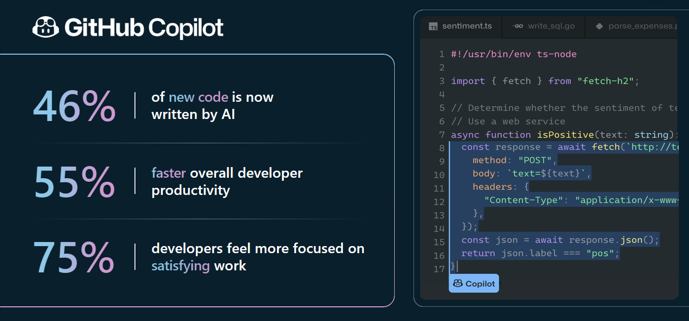

<div style="color:lightblue; font-weight:bold">

# Code Migration with Copilot X

</div>

Software languages evolve rapidly. COBOL was once one of the most prominent languages and remains in use within many large enterprises, where applications written entirely in COBOL are still operational.

The transition to more deterministic phases of software development is well underway, with AI becoming a crucial part of software systems and applications. Python, a language built on top of C, has become prevalent within the community. Thus, migrating to newer languages like Python can enhance reliability, scalability, and platform compatibility.

Copilot X offers several benefits for this migration process. Let's explore the advantages from both the developers' and the organization's perspectives.

<div style="color:lightblue; font-weight:bold">

## Guide

</div>

1. [Code Migration with Copilot X](#code-migration-with-copilot-x)
2. [Copilot X For Developers](#copilot-x-for-developers)
   - [Preparing to Engage with Copilot X](#preparing-to-engage-with-copilot-x)
        - [Crafting Effective Prompts](#crafting-effective-prompts)
   - [Code Migration In Action: Streamlining Your Development Workflow with Copilot X](#code-migration-in-action-streamlining-your-development-workflow-with-copilot-x)
        - [Use Case 1: Fibonacci Migration](#use-case-1-fibonacci-migration)
            + [Make it work](#make-it-work)
                - [Interpreting Code with Copilot X](#interpreting-code-with-copilot-x)
            + [Make it better](#make-it-better)
                - [Enhancing Code Quality](#enhancing-code-quality)
            + [Make it fast](#make-it-fast)
                - [Maximizing Performance](#maximizing-performance)
            + [Shipt it: Initiate Pull request](#shipt-it-initiate-pull-request)
3. [Copilot X For Organizations](#copilot-x-for-organizations)
   - [DORA Metric Improvements with Copilot X](#dora-metric-improvements-with-copilot-x)
4. [Copilot X Benefits](#copilot-x-benefits)

<div style="color:lightblue; font-weight:bold">

<br>

# Copilot X For Developers

</div>

A proficient developer follows the mental model:

<div style="color:lightgray; font-weight:bold">

### "Make it work, Make it right, Make it fast."

</div>

<br>

In the context of code migration:

- **Make it work:** Begin by understanding the original COBOL code. This involves studying the old language and the original developer's coding style, breaking down the logic, and thoroughly testing the code. This step can be complex if the documentation is outdated or scarce.
  
- **Make it right:** Adopt modern software engineering best practices, such as security checks, docstrings, typing, and adherence to the PEP 8 standards, especially when converting to Python. Testing is also crucial; unit and integration tests are a must, facilitated by CI/CD pipelines to maintain code quality.

- **Make it fast:** Focus on performance optimization in terms of runtime and memory consumption, where algorithmic efficiency is key.

## Preparing to Engage with Copilot X

Before starting our journey with Copilot X, understanding the art of prompt crafting is crucial. The prompts we provide serve as direct communication with the foundational model, acting as the steering wheel guiding the direction of our interaction. Optimizing our prompts ensures we receive the most relevant and accurate responses. Below is a brief guide on formulating effective prompts.

### Crafting Effective Prompts
To achieve the best interaction with Language Learning Models (LLM) such as Copilot X, one must craft well-structured prompts. The following formula serves as a guideline:

`[Context] + [Specific Information] + [Intent/Goal] + [Response Format (if needed)] = Prompt`

#### Example:
- **Context**: "As a beginner in gardening,"
- **Specific Information**: "interested in cultivating organic vegetables in a modest-sized garden,"
- **Intent/Goal**: "I am looking for a guide to start a vegetable garden at home,"
- **Response Format**: "and I would prefer the instructions in a simple infographic or a bullet-point list."

**Resulting Prompt**:
"As a beginner in gardening, interested in cultivating organic vegetables in a modest-sized garden, I am looking for a guide to start a vegetable garden at home. Could you provide that in a simple infographic or a bullet-point list?"

<br>

<div style="color:lightblue; font-weight:bold">

# Code Migration In Action: Streamlining Your Development Workflow with Copilot X

</div>

### Use Case 1: Fibonacci Migration

We are migrating a Fibonacci code from COBOL to Python. This simple example serves as a proof of concept, demonstrating the process that can be extended to multiple workloads. The Fibonacci sequence is a series where each number is the sum of the two preceding ones, typically starting with 0 and 1. Our objectives are:

- **Creating a Fibonacci function** that computes the sequence up to the `n-th` number.
- **Ensuring accurate output** based on the input, illustrating the sequence up to the provided index.

To integrate Copilot into your coding environment for this task, please visit [How to Setup Copilot Chat in VS Code](https://techcommunity.microsoft.com/t5/educator-developer-blog/step-by-step-how-to-setup-copilot-chat-in-vs-code/ba-p/3849227).

<div style="color:lightblue; font-weight:bold">

## Make it work:

</div>

### Interpreting Code with Copilot X

1. **Understanding the Code**:

    **Prompt**:

    ```
    "Explain the logic behind and provide an example demonstrating the input-output relationship."
    ```

2. **Code Translation**:

    **Prompt**:

    ```
    "Translate this code from COBOL to equivalent Python code."
    ```

<div style="color:lightblue; font-weight:bold">

## Make it better:

</div>

### Enhancing Code Quality

1. **Refining the Code Structure**:

    Enhance code by adding typing, DocString, and refactoring the structure according to industry best practices for a Python AI/ML engineering project.

    **Prompt**:

    ```
    "Given the Python function template, integrate typing, logging, error handling, and DocStrings following the provided structure and best practices for maintainability and readability.
    
    Example for reference : 
    
    def fetch_and_process_data(
        self,
        source_location: str,
        handler: Optional[DataHandler] = None,
        handler_name: Optional[str] = None,
        task_name: Optional[str] = None,
        extraction_query: Optional[str] = None,
        selected_fields: Optional[List] = None,
    ) -> ProcessedData:
        """
        Retrieve and transform data from the Specified Data Repository.

        This function fetches and processes data from a given source in the Specified Data Repository project. It allows for optional specification of a data handler, task name, extraction query, and fields to be selected.

        :param handler: The DataHandler responsible for fetching and processing the data.
        :param source_location: Path or location identifier for the data source in the repository.
        :param handler_name: (optional) Name of the data handler. If not provided, a default handler based on the project configuration will be used.
        :param task_name: (optional) Identifier for the data processing task. If not provided, it will default to the name of the data source.
        :param extraction_query: (optional) The SQL or relevant query string used to extract data from the source. If not provided, all available fields from the source will be retrieved.
        :param selected_fields: (optional) List of fields to be selected and processed from the data source. This parameter is ignored if an extraction query is provided.
        :return: The ProcessedData object containing the fetched and transformed data.
        :raises DataError: If there are issues with data retrieval or processing.
        """
    ```

2. **Optimizing Data Structures** (Optional):

    **Prompt**:

    ```
    "Evaluate if the current data structures utilized in the Fibonacci function are optimal, or suggest improvements."
    ```

3. **Implementing Unit Testing**:

    Develop unit tests using the pytest framework to validate the functionality and adherence to coding best practices.

    **Prompt**:

    ```
    "Please provide unit tests, developed using the pytest framework, ensuring adherence to the coding standards previously mentioned."
    ```

<div style="color:lightblue; font-weight:bold">

## Make it fast:

</div>

### Maximizing Performance

1. **Analyzing Complexity**:

    Evaluate the time complexity and space complexity of the code.

    **Prompt**:

    ```
    "What are the time and space complexities of the current Fibonacci function? Can you provide a more efficient version in terms of time and space complexity?"
    ```

<br>

## Shipt it: Initiate Pull request 

*Enhanced Pull Request Descriptions with GitHub Copilot X*

- **Narrative Pull Requests**: GitHub Copilot enhances the pull request experience by summarizing your changes into a coherent story. This not only auto-generates descriptive content for your PR but also assists reviewers in understanding the changes through a guided code walkthrough.

- **AI-Generated PR Descriptions**: With GitHub Copilot, gone are the days of neglecting pull request templates. It simplifies the process by automatically generating comprehensive PR descriptions. A few keystrokes (`TAB TAB TAB Submit`) are all it takes to prepare your PR for review.

- **Automated Test Generation**: GitHub Copilot takes automated testing to the next level. If your build is missing a unit test, Copilot detects it and can even suggest new test cases. This ensures your testing suite remains robust and up-to-date with minimal manual intervention.

<br>

<div style="color:lightblue; font-weight:bold">

# Copilot X For Organizations 

</div>

In the pursuit of operational excellence, Copilot X stands as a transformative tool in the DevOps arsenal. It's designed to optimize the software development lifecycle, positively impacting the DORA metrics, which are crucial indicators of an organization's agility and efficiency in software delivery. Let's explore how Copilot X influences these metrics, driving improvements that resonate across the workflow.

## DORA Metric Improvements with Copilot X

<table style="width:100%; border:1px solid blue;">
    <tr>
        <th style="font-weight:bold">Metric</th>
        <th style="font-weight:bold">Definition & Importance</th> 
        <th style="font-weight:bold">Previous Marks (Before Copilot X)</th>
        <th style="font-weight:bold">Improved Marks (With Copilot X)</th>
        <th style="font-weight:bold">Copilot X's Impact</th>
    </tr>
    <tr>
        <td>Deployment Frequency</td>
        <td>The rate of software deployments. Higher frequency indicates agile, responsive development practices.</td> 
        <td>Monthly or less frequently</td>
        <td>Multiple times per day</td>
        <td>Copilot X can enhance code quality and streamline development processes, allowing for more frequent deployments.</td>
    </tr>
        <td>Lead Time for Changes</td>
        <td>Time from code commit to production. Shorter lead times suggest efficient practices.</td> 
        <td>More than one week</td>
        <td>Less than one hour</td>
        <td>Copilot X can significantly reduce lead times by streamline development processes following company gold stardards and acellerating Approval (Pull Request) process.</td>
    </tr>
    <tr>
        <td>Change Failure Rate</td>
        <td>Percentage of deployments causing a failure in production. Lower rates denote better quality and reliability.</td> 
        <td>Above 15%</td>
        <td>Less than 5%</td>
        <td>Copilot X helps improve code reliability through better code suggestions and readines, potentially reducing the change failure rate.</td>
    </tr>
        <td>Time to Restore Service</td>
        <td>Time taken to recover from a failure or outage. Faster recovery shows better resilience and reliability.</td> 
        <td>Greater than 24 hours</td>
        <td>Less than 1 hour</td>
        <td>Quicker identification of issues and code fixes with Copilot X can lead to reduced service restoration times.</td>
    </tr>
</table>

<br>


<div style="color:lightblue; font-weight:bold">

# Copilot X Benefits  

</div>

*Copilot X not only amplifies developer productivity by up to 55% but also significantly elevates code quality. This integration propels organizations towards DevOps excellence, optimizing the overall formula of people plus platform. By enhancing productivity metrics, Copilot X effectively reduces the Total Cost of Ownership (TCO) for software AI/ML development.*


<div style="border: 2px solid black; padding: 10px;">

<div style="font-weight:bold; text-align:center; font-size:2em;">
    <p>Boost ROI = <span style="color:#FF6347;">Decrease TCO</span> + <span style="color:#4682B4;">Improve DORA metrics</span></p>
</div>

<br>

<div style="font-weight:bold; text-align:center; font-size:1.5em;">
    <p>TCO AI/ML Project = <span style="color:#FF6347;">Developers</span> + <span style="color:#4682B4;">Platform</span></p>
</div>

</div>

<br>

The integration of advanced tools like Copilot X boosts developer productivity by an estimated 56%, leading to a streamlined development lifecycle and quicker time-to-market. This heightened productivity correlates with a reduced Total Cost of Ownership (TCO) as more efficient developers and enhanced platforms drive down costs related to time, resources, and overheads.

Consequently, the Return on Investment (ROI) experiences a notable surge. Investments in cutting-edge technology translate into measurable outputs and business value, optimizing financial returns. Lower TCO coupled with increased productivity ultimately culminates in an elevated ROI, solidifying the financial viability of investing in technology that propels both the workforce and infrastructure towards optimal performance.</p>





