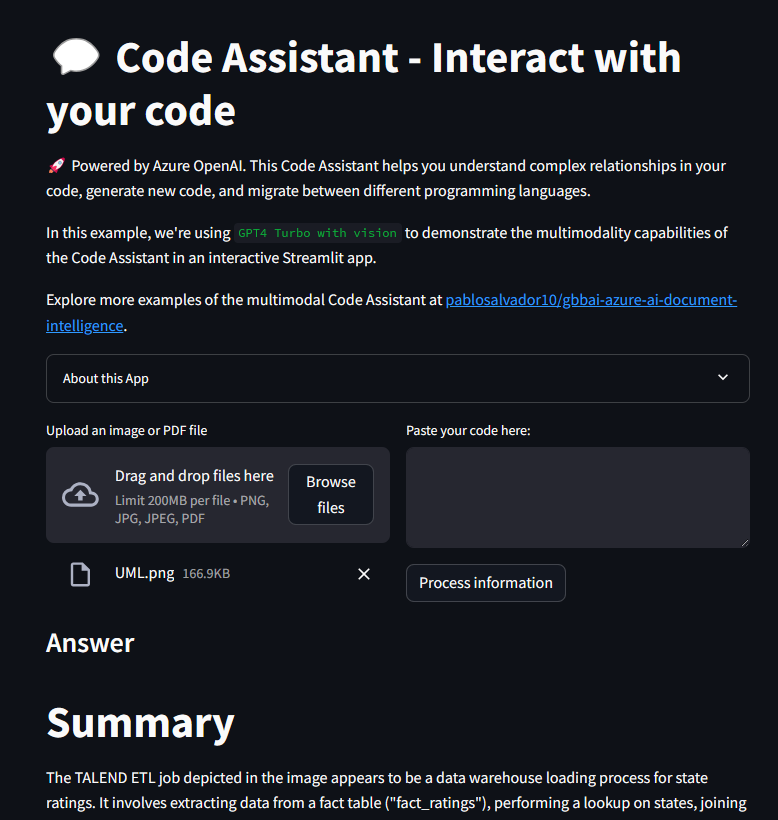

#   Multimodal AI Code Copilot 

Welcome to the Multimodal AI Code Copilot Project! This repository is designed to facilitate the development of code muigration betwen lenguages and platforms using Azure AI services and OpenAI's GPT-4 Turbo Vision model.

## 📚 Project Overview

This project includes:

- **Multimodal AI Integration**: Utilize the power of OpenAI's GPT-4 Turbo Plus Vision model to understand and translate complex diagrams, workflows, and UML designs. This approach combines text and visual inputs to handle a wide range of tasks and scenarios, making our AI solutions more versatile and effective.
- **Azure AI Services**: Leverage Azure AI services to build advanced AI applications. These services provide the infrastructure and tools needed to develop, deploy, and manage AI solutions at scale.
- **Chatbot Development**: Develop a chatbot using Azure AI services and OpenAI's GPT-4 Turbo Plus Vision model. The chatbot can understand and respond to user queries in a natural, conversational manner, providing a user-friendly interface for interacting with the AI system.


## 🚀 Run the app

This project includes a Streamlit application that provides a user-friendly interface for interacting with our AI system.



To run the Streamlit app, follow these steps:

> Please refer to the 'Prerequisites' section before proceeding.

1. Navigate to the root directory of the project.

2. Activate your conda environment. Replace `your_env_name` with the name of your conda environment:

    ```sh
    conda activate your_env_name
    ```

3. Run the Streamlit app with the following command:

    ```sh
    streamlit run src/Chatbot.py
    ```

4. Open your web browser and go to `http://localhost:8501` to view the app.


## 🔧 Prerequisites

Please make sure you have met all the prerequisites for this project. A detailed guide on how to set up your environment and get ready to run all the notebooks and code in this repository can be found in the [SETTINGS.md](SETTINGS.md) file. Please follow the instructions there to ensure a smooth exprience.

## 💼 Contributing:

Eager to make significant contributions? Our **[CONTRIBUTING](./CONTRIBUTING.md)** guide is your essential resource! It lays out a clear path.

- To stay updated with the latest developments and document significant changes to this project, please refer to [CHANGELOG.md](CHANGELOG.md).